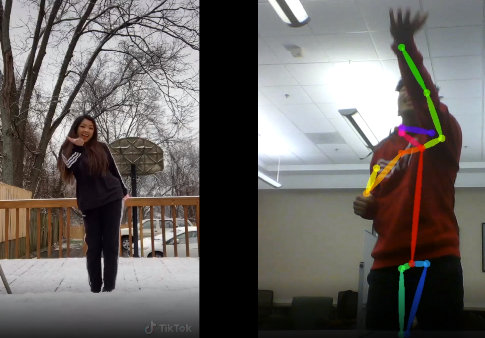

# Just Renegade

	

Just Renegade TikTok Skeleton Tracking App, a UGAHacks 5 submission. Uses OpenPose/OpenCV to process videos of TikTok dances and user submissions, then uses geometric angle differentiation and advanced mathematics and data analysis to compare for accuracy. No fully live demo right now due to hackathon restrictions on development time but real-time data analysis and comparison can be implemented in the future.

We followed the [OpenPose installation guide](https://github.com/CMU-Perceptual-Computing-Lab/openpose/blob/master/doc/installation.md) to build the necessary libraries to process the input data. A result video with a skeleton tracking overlay is generated in addition to tons of json output data, upon which we conducted data analysis with Python scripts. All of this is then loaded with a Bootstrap/JQuery frontend and displayed as a webpage for the end user.

* [Usage](#usage)
* [Documentation](#documentation)
* [Authors](#authors)
* [License](#license)

## Usage
Visit [justrenegade.tech](http://justrenegade.tech) for a temporary video demonstration of the project.

## Built With
* [OpenPose](https://github.com/CMU-Perceptual-Computing-Lab/openpose) - Real-time multi-person keypoint detection library for body, face, hands, and foot estimation created and maintained by members of Carnegie Mellon University

* [Selenium](https://selenium.dev/) - a portable framework for testing web applications; provides a playback tool for authoring functional tests without the need to learn a test scripting language

* [NumPy](https://numpy.org/) - a library for the Python programming language, adding support for large, multi-dimensional arrays and matrices, along with a large collection of high-level mathematical functions

* [Bootstrap](https://getbootstrap.com/) - an open source toolkit for developing with HTML, CSS, and JS

* [JQuery](https://jquery.com/) - a JavaScript library designed to simplify HTML DOM tree traversal and manipulation, as well as event handling, CSS animation, and Ajax

* [TikTok](https://www.tiktok.com/) - a video-sharing social networking service used to create short lip-sync, comedy, and talent videos

## Documentation
We did not have time to write documentation.

## Authors
* **Richard Red** - *OpenPose/OpenCV infrastructure, TikTok dance* - [richardred](https://github.com/richardred)
* **Sarah Yoo** - *Bootstrap frontend implementation* - [gayeonsarahyoo](https://github.com/gayeonsarahyoo)
* **Kavin Phan** - *Basically everything* - [phan-kavin](https://github.com/phan-kavin)
* **Kelly Tran** - *JQuery frontend design* - [kellytran3k](https://github.com/kellytran3k)

## License
This project is licensed under the MIT License - see the [License](LICENSE) file for details
